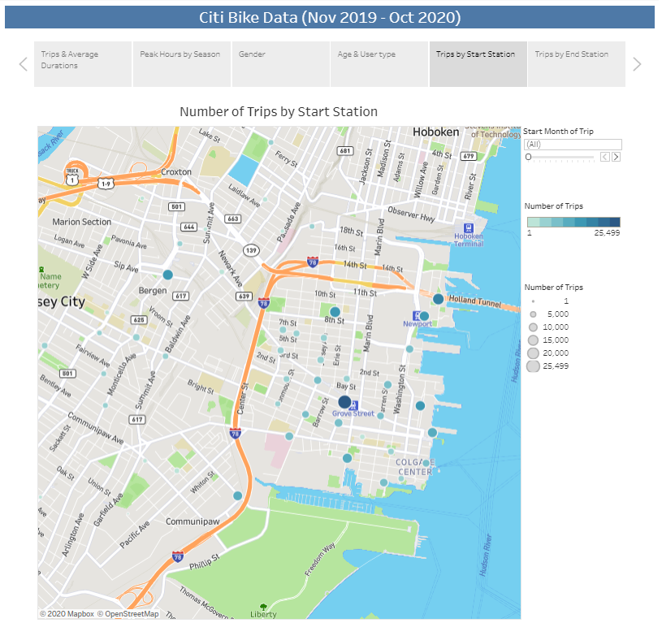

# Tableau Homework - Citi Bike Analytics

# Analysis

For this project, data from the rolling 12-month period (Nov 2019 - Oct 2020) was used. Data was first cleaned to remove anyone with a birthdate of 1920 or earlier and then for any outliers for trip duration in order to make sure the data was as viable as possible.

[Link to Tableau Workbook](https://public.tableau.com/profile/nicole1701#!/vizhome/CitiBikeData_16071222827510/CityBikeData)

[Citi Bike System Data ](https://www.citibikenyc.com/system-data)

## Number of Trips/Trip Duration

For the time period studied, there was a total of 325,044 Citi Bike trips taken, with the majority of those trips taking place in the summer (32%) and autumn (33%), with October having the most rides (40,646). Spring (14%) and Winter (21%) have the fewest number of trips taken, with April having the least of all (8,345). The reason for the April numbers being so low may be due to the emergence of Covid-19 and statewide lockdown orders. Analysis of previous year's seasonal data may yield additional information.

While Spring may have the fewest trips taken, it has the second highest average ride duration (14.8 mins), with May having the highest average ride duration, clocking in at 18.4 mins.

## Peak Hours by Season

During the summer 5pm to 8pm is a peak time for riders, while the hours of midnight to 6am have very few rides. In winter, there appears to be two peak times: 8am and again from 5pm to 7pm. These tend to coincide with traditional rush hour traffic. While the summer of 2019 does not appear to have the morning peak like winter, this can perhaps be explained by more people working from home due to Covid-19 as well as school not being in session in the summer, perhaps pushing potential ride times until later in the day.

## Gender

72% of all Citi Bike users are male, while females make up around 28%. While the numbers of trips taken by each gender follow a similar pattern over the last 12 months, the peaks tend to be higher for males, while females are a little more constant month to month.

When looking at the average trip duration by gender, females are consistently riding longer than males each month for the last 12 months.

## Age & User Type

By far, the most active group for Citi Bike usage is the 25to 34 year old group. People in this age group are less established in their careers, so they would likely have less money to pay for taxis or have a private form of transportation, thus making a program like Citi Bike more appealing.

When looking at trip duration, however, the 16-24 year old group has the highest average duration, with females in this grouping having the highest average duration among all groups at 16.68 minutes. In all age groups but 55 to 64 years females rode for longer, on average, than males.

76% of Citi Bike users are subscribers. Subscribers take much shorter trips than customers, with female customers having an average ride time of 21.21 mins, compared to only 10.62 of female subscribers.

## Trips by Start Station

Grove Path station is by far the most popular starting station overall, followed by Newport Pkwy and Hamilton Park.

## Trips by End Station

As similar pattern is seen for ending stations, where Grove Path remains the most popular station, followed by Newport Pkwy and Hamilton Park.

## Background

Congratulations on your new job! As the new lead analyst for the [New York Citi Bike](https://en.wikipedia.org/wiki/Citi_Bike) Program, you are now responsible for overseeing the largest bike sharing program in the United States. In your new role, you will be expected to generate regular reports for city officials looking to publicize and improve the city program.

Since 2013, the Citi Bike Program has implemented a robust infrastructure for collecting data on the program's utilization. Through the team's efforts, each month bike data is collected, organized, and made public on the [Citi Bike Data](https://www.citibikenyc.com/system-data) webpage.

However, while the data has been regularly updated, the team has yet to implement a dashboard or sophisticated reporting process. City officials have a number of questions on the program, so your first task on the job is to build a set of data reports to provide the answers.

## Task

Your task in this assignment is to aggregate the data found in the Citi Bike Trip History Logs and find two unexpected phenomena.

Design 2-5 visualizations for each discovered phenomena (4-10 total). You may work with a timespan of your choosing. Optionally, you may merge multiple datasets from different periods.

The following are some questions you may wish to tackle. Do not limit yourself to these questions; they are suggestions for a starting point. Be creative!

- How many trips have been recorded total during the chosen period?

- By what percentage has total ridership grown?

- How has the proportion of short-term customers and annual subscribers changed?

- What are the peak hours in which bikes are used during summer months?

- What are the peak hours in which bikes are used during winter months?

- Today, what are the top 10 stations in the city for starting a journey? (Based on data, why do you hypothesize these are the top locations?)

- Today, what are the top 10 stations in the city for ending a journey? (Based on data, why?)

- Today, what are the bottom 10 stations in the city for starting a journey? (Based on data, why?)

- Today, what are the bottom 10 stations in the city for ending a journey (Based on data, why?)

- Today, what is the gender breakdown of active participants (Male v. Female)?

- How effective has gender outreach been in increasing female ridership over the timespan?

- How does the average trip duration change by age?

- What is the average distance in miles that a bike is ridden?

- Which bikes (by ID) are most likely due for repair or inspection in the timespan?

- How variable is the utilization by bike ID?

**Next, as a chronic over-achiever:**

- Use your visualizations (does not have to be all of them) to design a dashboard for each phenomena.
- The dashboards should be accompanied with an analysis explaining why the phenomena may be occuring.

**City officials would also like to see one of the following visualizations:**

- **Basic:** A static map that plots all bike stations with a visual indication of the most popular locations to start and end a journey with zip code data overlaid on top.

- **Advanced:** A dynamic map that shows how each station's popularity changes over time (by month and year). Again, with zip code data overlaid on the map.

- The map you choose should also be accompanied by a write-up unveiling any trends that were noticed during your analysis.

**Finally, create your final presentation**

- Create a Tableau story that brings together the visualizations, requested maps, and dashboards.
- This is what will be presented to the officials, so be sure to make it professional, logical, and visually appealing.

## Considerations

Remember, the people reading your analysis will **NOT** be data analysts. Your audience will be city officials, public administrators, and heads of New York City departments. Your data and analysis needs to be presented in a way that is focused, concise, easy-to-understand, and visually compelling. Your visualizations should be colorful enough to be included in press releases, and your analysis should be thoughtful enough for dictating programmatic changes.

## Submission

Your final submission should include:

- A link to your Tableau Public workbook that includes:
  - 4-10 Total "Phenomenon" Visualizations
  - 2 Dashboards
  - 1 City Official Map
  - 1 Story
- A text or markdown file with your analysis on the phenomenons you uncovered from the data.

## Sharing Your Work

In order to share your work, we are asking that you will save your workbook as a .twbx file so that your TA's can grade them.

To save your workbook as a .twbx file, you will just need to select "Save As..." from the "File" dropdown. Then, select the .twbx option.

## Assessment

Your final product will be assessed on the following metrics:

- Analytic Rigor

- Readability

- Visual Attraction
